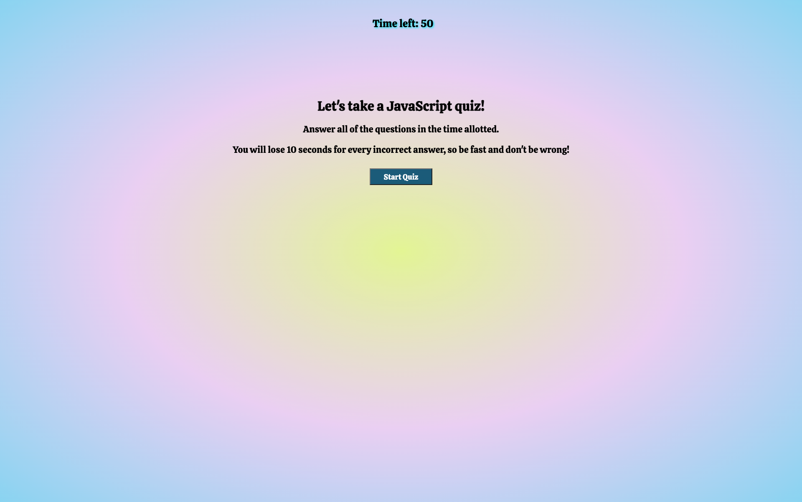
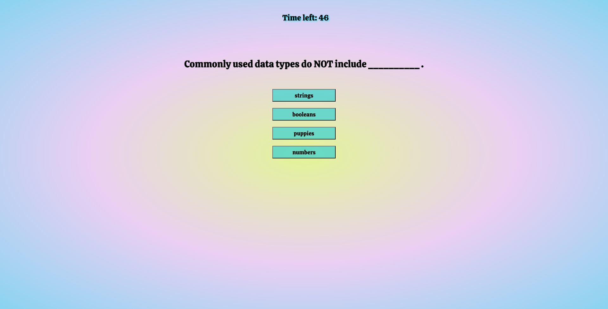
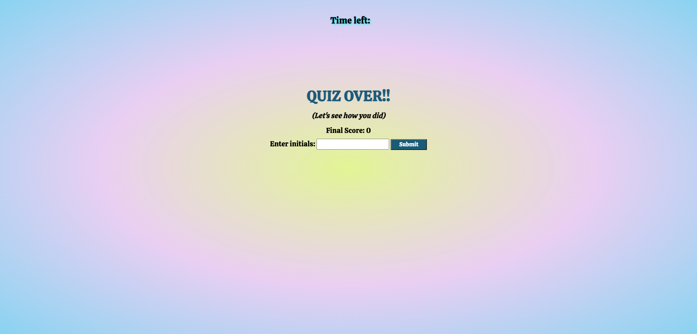
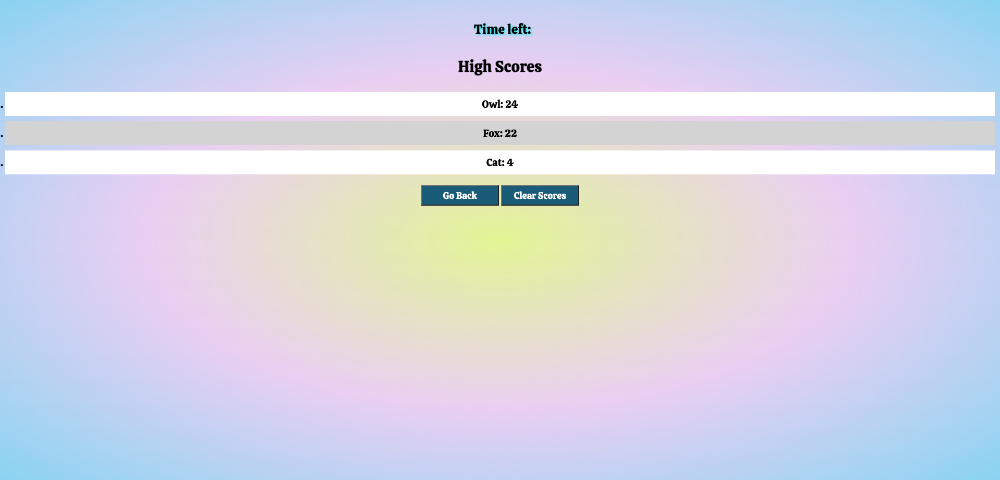

# JavaScript Quiz

This project is a JavaScript Quiz that allows the user to test their knowledge of JavaScript concepts. It features a timer that starts when the user clicks the start button, questions presented one by one with four answer choices, it deducts 10 seconds for each incorrect answer, and ends the quiz when all questions are answered or the timer reaches zero.

After completing the quiz, the user can save their initials and score, and can see a list of the previous 5 high scores. The user can also clear the high scores by clicking a button, and can click another button to go back to the start screen and take the quiz again.

## Technologies Used

- HTML
- CSS
- JavaScript

## Features

- Start button: The user starts the quiz by clicking the "Start Button." This button takes the user to the questions screen, initiates the timer, and presents the first question and set of answer choices.
- Timer: The timer starts at 50 seconds and counts down 1 second at a time. 10 seconds are deducted for each question the user answers incorrectly. If the timer reaches zero or all questions are answered, the quiz ends.
- Questions: The quiz presents a series of multiple-choice questions, one at a time. Each question is displayed with four answer choices.
- Answer Validation: When the user selects an answer, the quiz checks if the answer is correct. If correct, a "Correct!" message is displayed. If incorrect, a "Incorrect!" message is displayed, and 10 seconds are deducted from the timer.
- Next Question: After answering a question, the quiz moves on to the next question. If there are no more questions, the quiz ends.
- End Screen: When the quiz ends, the end screen displays the user's final score, which is the time remaining on the timer. The user can then save their initials, using up to 3 letters, as well as their score. If it is one of the top 5 scores, it will be displayed on the high scores screen.
- High Scores: The quiz includes a high scores screen where users can view the top 5 user scores and initials. Scores are stored locally using `localStorage`.
- Go Back: On the high scores screen, the user can click the "Go Back" button to return to the start screen and take the quiz again.
- Clear Scores: On the high scores screen, the user can click the "Clear Scores" button to clear all currently saved high scores.

## Getting Started

To run this project locally, follow these steps:

1. Clone the repository: `git clone <https://github.com/Augustus1110/Challenge-4-JavaScript-Quiz.git>`
2. Navigate to the project directory: `Challenge-4-JavaScript-Quiz`
3. Open the `index.html` file in a web browser.

## Usage

- Click the "Start" button to begin the quiz.
- Read each question and select an answer by clicking on the corresponding button.
- If your answer is correct, a "Correct!" message will be displayed.
- If your answer is incorrect, a "Incorrect!" message will be displayed, and 10 seconds will be deducted from the timer.
- After answering a question, the quiz will move on to the next question.
- Once all questions are answered or the timer reaches zero, the quiz ends.
- On the end screen, enter your initials and click the "Submit" button to save your score.
- You can view the high scores by clicking the "Submit" button.
- On the high scores screen, you can click the "Go Back" button to return to the start screen and take the quiz again.
- To clear all high scores, click the "Clear Scores" button.

## Screenshots

## Credits

This project was developed by Donahi Casas-Silva. It was created as part of the UC Berkeley Extension Coding Bootcamp curriculum and is based on the requirements in the instructional materials.

The questions used in the quiz are a sample set provided in the instructional materials and can be customized by modifying the `questions` array in the JavaScript code.

This quiz was created with help from the following people and resources:

#### Instructors/Tutors/Collaborators:

UC Berkeley Extension Bootcamp course instructor, Teaching Assistants, Zoom video tutors and AskBCS Learning Assistant. 

Special thanks to the Group 4 "Dream Team" for the help provided during our study sessions.

#### Web Resources:

- w3schools.com
- developer.mozilla.org (MDN web docs)
- Codecademy.com
- chat.openai.com
- bard.google.com
- Google.com

